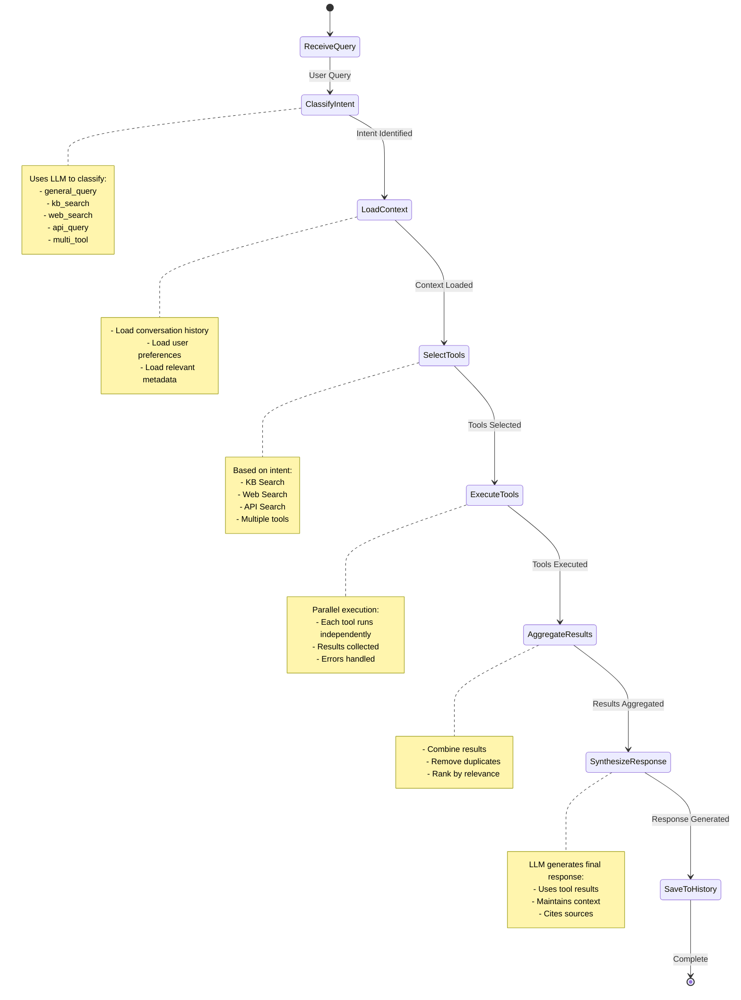
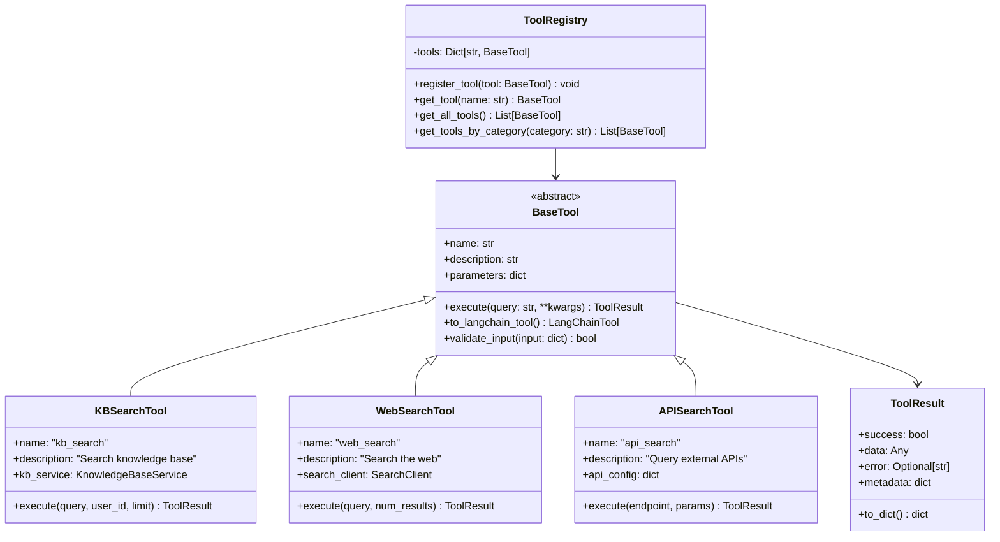
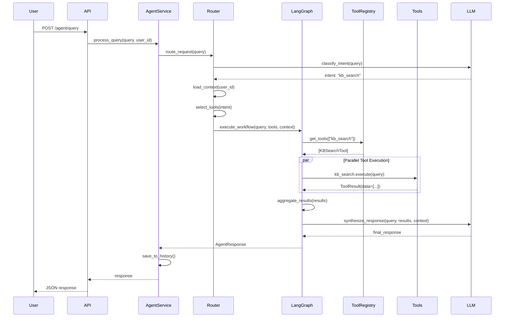
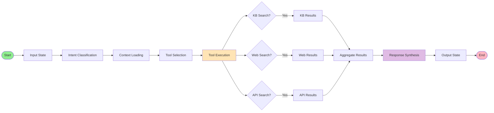
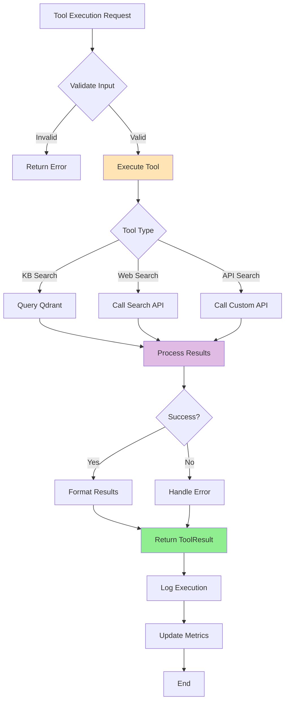
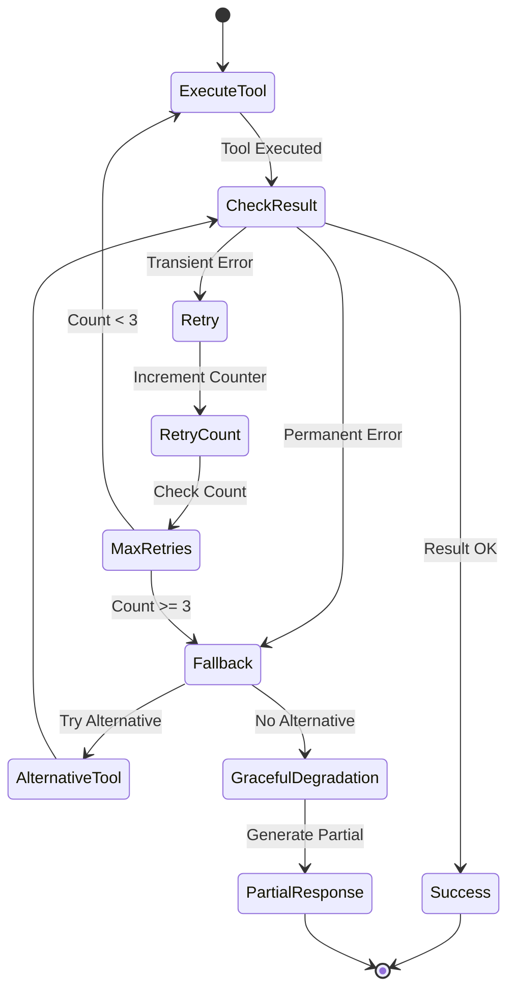
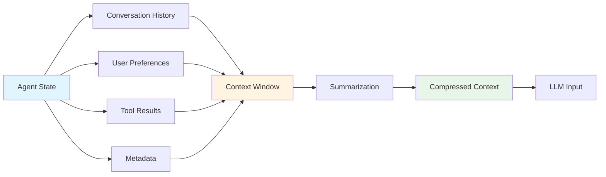

# AI Agent Architecture - Simplified

## Overview

Simple agent that uses tools to answer questions. User asks → Agent thinks → Uses tools → Returns answer.

## Simple Flow

```mermaid
graph LR
    A[User: "What is SBKPA?"] --> B[Agent]
    B --> C{Which Tool?}
    C -->|Company Info| D[KB Search]
    C -->|Web Info| E[Web Search]
    C -->|API Data| F[API Call]
    D --> G[Combine Results]
    E --> G
    F --> G
    G --> H[Answer User]
```

## How It Works



## Tool System Architecture



## Agent Orchestration Flow



## LangGraph State Machine



## Tool Execution Pipeline



## Multi-Tool Coordination

```mermaid
graph TB
    Query[User Query: "What's the latest on AI and our company policy?"]
    
    Query --> Classifier[Intent Classifier]
    Classifier --> MultiTool[Multi-Tool Intent]
    
    MultiTool --> Parallel[Parallel Execution]
    
    Parallel --> KB[KB Search Tool]
    Parallel --> Web[Web Search Tool]
    
    KB --> KBResult["Company AI Policy<br/>(from KB)"]
    Web --> WebResult["Latest AI News<br/>(from Web)"]
    
    KBResult --> Aggregator[Result Aggregator]
    WebResult --> Aggregator
    
    Aggregator --> Ranker[Relevance Ranker]
    Ranker --> Deduplicator[Deduplicator]
    Deduplicator --> Synthesizer[Response Synthesizer]
    
    Synthesizer --> Response["Combined Response:<br/>1. Company policy: ...<br/>2. Latest news: ..."]
    
    style Query fill:#E1F5FF
    style Parallel fill:#FFF4E1
    style Response fill:#E8F5E9
```

## Error Handling & Retry Logic



## Context Management



## Refined Task Breakdown

### Task 10.1: Base Tool Interface
**Purpose**: Create abstract foundation for all tools

**Implementation**:
```python
# app/services/tools/base.py
- BaseTool (ABC)
  - Properties: name, description, parameters_schema
  - Methods: execute(), validate_input(), to_langchain_tool()
  
- ToolResult (dataclass)
  - Fields: success, data, error, metadata, execution_time
  - Methods: to_dict(), is_successful()
  
- ToolError (Exception)
  - Custom exception for tool failures
```

**Requirements**: 3.4 (Tool interface standardization)

---

### Task 10.2: Web Search Tool
**Purpose**: Enable agent to search the internet

**Implementation**:
```python
# app/services/tools/web_search.py
- WebSearchTool(BaseTool)
  - Integration: Tavily API or Serper API
  - Methods: 
    - execute(query, num_results=5)
    - _parse_results()
    - _rank_by_relevance()
  
- Configuration:
  - API key from environment
  - Configurable result count
  - Domain filtering
```

**Requirements**: 3.1 (Web search capability)

---

### Task 10.3: API Search Tool
**Purpose**: Query external APIs dynamically

**Implementation**:
```python
# app/services/tools/api_search.py
- APISearchTool(BaseTool)
  - Support: REST APIs with JSON
  - Methods:
    - execute(endpoint, method, params, headers)
    - _authenticate()
    - _parse_response()
  
- Features:
  - Multiple auth methods (Bearer, API Key, OAuth)
  - Request/response transformation
  - Rate limiting
```

**Requirements**: 3.2 (External API integration)

---

### Task 10.4: KB Search Tool
**Purpose**: Search internal knowledge base

**Implementation**:
```python
# app/services/tools/kb_search.py
- KBSearchTool(BaseTool)
  - Integration: KnowledgeBaseService
  - Methods:
    - execute(query, user_id, limit=5, threshold=0.5)
    - _format_results()
    - _add_citations()
  
- Features:
  - Semantic search via Qdrant
  - User-scoped results
  - Document citations
```

**Requirements**: 3.3 (KB search integration)

---

### Task 10.5: Tool Registry
**Purpose**: Centralized tool management

**Implementation**:
```python
# app/services/tools/tool_registry.py
- ToolRegistry (Singleton)
  - Methods:
    - register_tool(tool)
    - get_tool(name)
    - get_all_tools()
    - get_tools_by_category()
    - get_tools_for_intent(intent)
  
- Features:
  - Auto-discovery of tools
  - Tool validation
  - Dependency injection
```

**Requirements**: 3.4, 3.5 (Tool management and discovery)

---

## Integration Points

### 1. Agent Service Integration
```python
# app/services/agent/agent_service.py
- Uses ToolRegistry to get available tools
- Passes tools to LangGraph workflow
- Handles tool execution results
```

### 2. LangGraph Integration
```python
# app/services/agent/langgraph_workflow.py
- Defines state machine
- Orchestrates tool execution
- Manages context and history
```

### 3. Router Integration
```python
# app/services/agent/routing/tool_selector.py
- Maps intents to tools
- Selects appropriate tools based on query
```

## Observability

### Metrics to Track
- Tool execution time
- Tool success/failure rate
- Tool usage frequency
- Result quality scores
- Error rates by tool

### Logging
- Tool invocations
- Input/output data
- Errors and retries
- Performance metrics

### Tracing (Langfuse)
- End-to-end request tracing
- Tool execution spans
- LLM call tracking
- Context propagation

## Testing Strategy

### Unit Tests
- Each tool in isolation
- ToolResult validation
- Error handling
- Input validation

### Integration Tests
- Tool registry operations
- LangGraph workflow
- Multi-tool coordination
- Error recovery

### End-to-End Tests
- Complete agent queries
- Real API calls (with mocking)
- Performance benchmarks
- Load testing

## Next Steps

1. Implement BaseTool and ToolResult
2. Create KBSearchTool (uses existing KB service)
3. Implement WebSearchTool (integrate Tavily/Serper)
4. Create APISearchTool (generic REST client)
5. Build ToolRegistry
6. Integrate with LangGraph workflow
7. Add comprehensive testing
8. Implement observability
