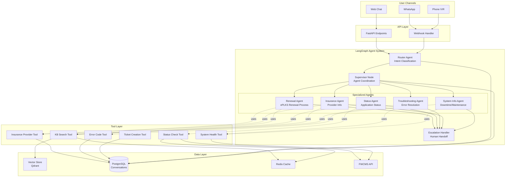
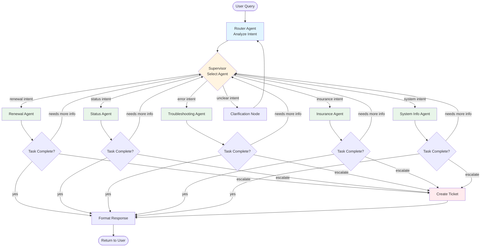
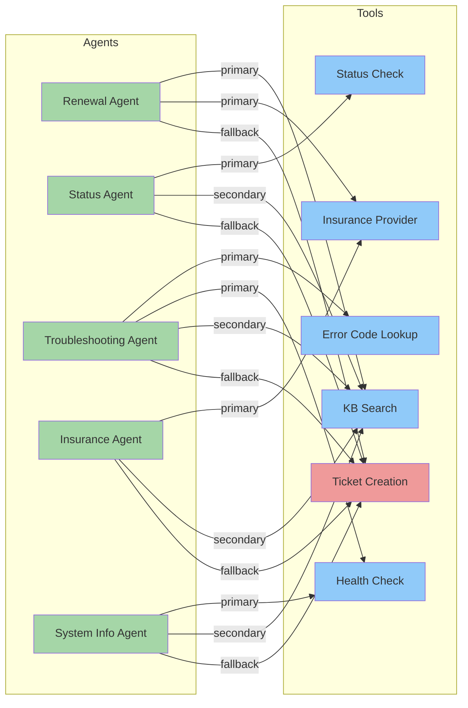
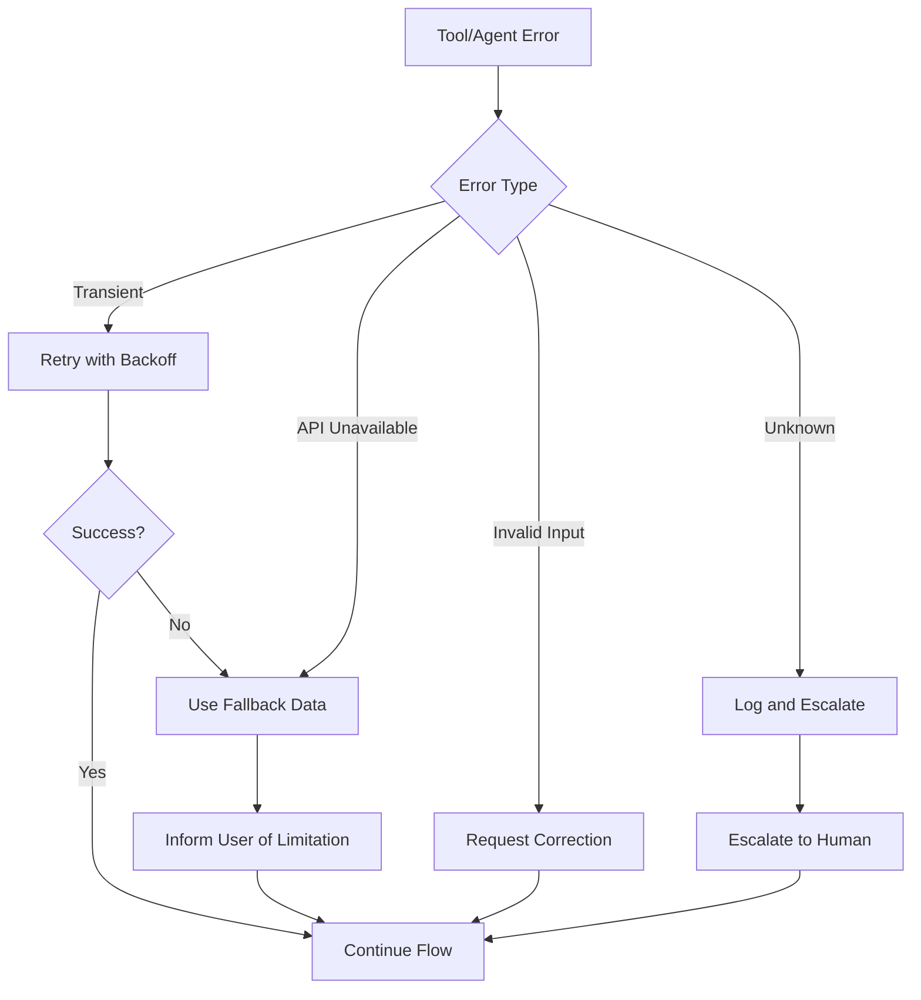
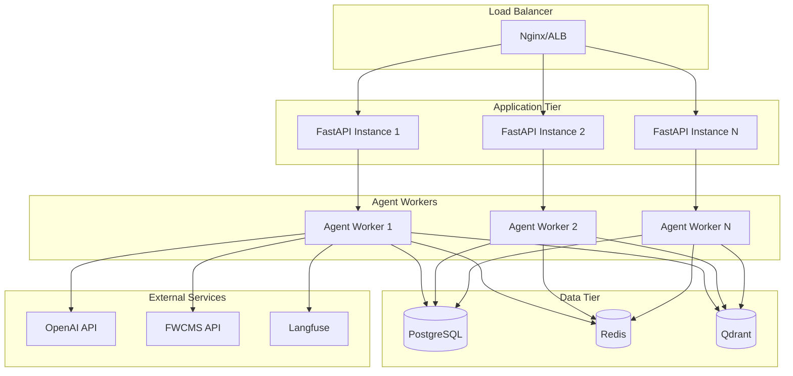

# Design Document: ePLKS LangGraph Agent System

## Overview

This design implements a multi-agent system using LangGraph to handle ePLKS/FWCMS queries with semantic understanding, minimal conditional logic, and optimal performance. The architecture uses a supervisor pattern where a Router Agent coordinates specialized domain agents, each equipped with specific tools for their tasks.

### Key Design Principles

1. **Semantic-First**: All routing and retrieval uses embeddings and LLM reasoning, not keyword matching
2. **Agent Specialization**: Each agent focuses on a specific domain with dedicated tools
3. **Stateful Workflows**: LangGraph manages conversation state and agent transitions
4. **Tool Composition**: Agents use composable tools that can be shared or specialized
5. **Progressive Enhancement**: System works with minimal data and scales as KB/APIs are added
6. **Cost Efficiency**: Smart model selection (small for routing, large for reasoning)

## Architecture

### High-Level System Architecture



### LangGraph State Graph Architecture



### Agent-Tool Relationship Matrix



## Components and Interfaces

### 1. Router Agent

**Purpose**: Analyzes user queries to determine intent and extract key information.

**Implementation**:
- Uses GPT-4o-mini for fast, cost-effective intent classification
- Generates query embedding for semantic similarity matching
- Maintains conversation context for multi-turn understanding
- Outputs structured intent with confidence score

**Interface**:
```python
class RouterAgent:
    async def analyze_intent(
        self,
        query: str,
        conversation_history: List[Message],
        user_context: UserContext
    ) -> IntentAnalysis:
        """
        Returns:
            IntentAnalysis(
                intent_type: IntentType,  # RENEWAL, STATUS, TROUBLESHOOTING, etc.
                confidence: float,
                extracted_entities: Dict[str, Any],  # worker_id, passport_no, etc.
                requires_clarification: bool,
                clarification_questions: List[str]
            )
        """
```

**Decision Logic**:
- Embedding similarity against intent examples (cached)
- LLM reasoning for complex or ambiguous queries
- Context-aware: considers user journey stage and previous messages

### 2. Supervisor Node

**Purpose**: Coordinates agent selection and manages workflow transitions.

**Implementation**:
- Receives IntentAnalysis from Router
- Selects appropriate specialized agent
- Manages agent state transitions
- Handles multi-agent scenarios (e.g., renewal + insurance)

**Interface**:
```python
class SupervisorNode:
    async def route_to_agent(
        self,
        intent: IntentAnalysis,
        state: ConversationState
    ) -> AgentSelection:
        """
        Returns:
            AgentSelection(
                agent_type: AgentType,
                agent_config: Dict[str, Any],
                tools_enabled: List[str],
                max_iterations: int
            )
        """
```

### 3. Specialized Agents

#### Renewal Agent

**Responsibilities**:
- Explain ePLKS renewal process
- Guide through insurance requirements
- Provide step-by-step instructions
- Handle renewal-related questions

**Tools**:
- KB Search (renewal procedures, requirements)
- Insurance Provider Tool (authorized providers)

**Prompt Strategy**:
```
You are a renewal specialist for ePLKS permits. Your role is to:
1. Explain the renewal process clearly and concisely
2. Emphasize insurance requirements
3. Provide step-by-step guidance
4. Use the KB Search tool to find specific procedures
5. Use the Insurance Provider tool to list authorized providers

Always structure responses as:
- Current situation assessment
- Required steps
- Important notes/warnings
- Next actions
```

#### Status Agent

**Responsibilities**:
- Check application status
- Explain status meanings
- Provide tracking guidance
- Handle status-related queries

**Tools**:
- Status Check Tool (FWCMS API integration)
- KB Search (status explanations)

**Prompt Strategy**:
```
You are a status specialist. Your role is to:
1. Request necessary identifiers (passport/worker ID) if not provided
2. Check status using the Status Check tool
3. Explain what the status means in plain language
4. Provide guidance on next steps
5. Set realistic expectations for processing times

Always validate identifiers before making API calls.
```

#### Troubleshooting Agent

**Responsibilities**:
- Diagnose system errors
- Provide solutions
- Escalate unresolved issues
- Handle technical problems

**Tools**:
- Error Code Tool (error database)
- Health Check Tool (system status)
- KB Search (troubleshooting guides)

**Prompt Strategy**:
```
You are a troubleshooting specialist. Your role is to:
1. Identify the specific error or problem
2. Look up error codes using the Error Code tool
3. Provide step-by-step solutions
4. Verify system health if needed
5. Escalate after 2 failed resolution attempts

Always ask for error codes, screenshots, or specific symptoms.
```

#### Insurance Agent

**Responsibilities**:
- Provide insurance information
- List authorized providers
- Explain insurance requirements
- Handle insurance-related queries

**Tools**:
- Insurance Provider Tool (provider database)
- KB Search (insurance requirements)

#### System Info Agent

**Responsibilities**:
- Provide system status information
- Explain maintenance schedules
- Handle downtime queries
- Provide workarounds

**Tools**:
- Health Check Tool (system status API)
- KB Search (maintenance schedules)

### 4. Tool Layer

#### KB Search Tool

**Purpose**: Semantic search across knowledge base documents.

**Implementation**:
```python
class KBSearchTool:
    async def search(
        self,
        query: str,
        filters: Optional[Dict[str, Any]] = None,
        top_k: int = 5
    ) -> List[KBResult]:
        """
        1. Generate query embedding
        2. Search vector store with filters
        3. Rerank results using cross-encoder
        4. Return top_k results with metadata
        """
```

**Caching Strategy**:
- Cache query embeddings (1 hour TTL)
- Cache search results for common queries (30 min TTL)
- Invalidate cache on KB updates

#### Status Check Tool

**Purpose**: Query FWCMS API for application status.

**Implementation**:
```python
class StatusCheckTool:
    async def check_status(
        self,
        identifier: str,
        identifier_type: IdentifierType
    ) -> ApplicationStatus:
        """
        1. Validate identifier format
        2. Call FWCMS API (with retry logic)
        3. Parse and structure response
        4. Cache result (5 min TTL)
        """
```

**Progressive Enhancement**:
- Phase 1: Return mock data with disclaimer
- Phase 2: Integrate with actual FWCMS API
- Phase 3: Add real-time status updates

#### System Health Tool

**Purpose**: Check system availability and maintenance status.

**Implementation**:
```python
class SystemHealthTool:
    async def check_health(self) -> SystemHealth:
        """
        1. Ping FWCMS endpoints
        2. Check maintenance schedule
        3. Return status and ETA
        """
```

#### Insurance Provider Tool

**Purpose**: Retrieve authorized insurance provider information.

**Implementation**:
```python
class InsuranceProviderTool:
    async def get_providers(
        self,
        filters: Optional[Dict[str, Any]] = None
    ) -> List[InsuranceProvider]:
        """
        1. Query provider database
        2. Apply filters (location, type, etc.)
        3. Return formatted provider list
        """
```

#### Error Code Tool

**Purpose**: Look up error codes and solutions.

**Implementation**:
```python
class ErrorCodeTool:
    async def lookup_error(
        self,
        error_code: str
    ) -> ErrorInfo:
        """
        1. Search error database
        2. Return error description and solutions
        3. Include related errors
        """
```

## Data Models

### Conversation State

```python
class ConversationState(BaseModel):
    """LangGraph state object passed between nodes"""
    conversation_id: str
    user_id: str
    channel: ChannelType
    
    # Message history
    messages: List[Message]
    
    # Intent and routing
    current_intent: Optional[IntentAnalysis]
    active_agent: Optional[AgentType]
    agent_history: List[AgentType]
    
    # Extracted entities
    entities: Dict[str, Any]  # worker_id, passport_no, error_code, etc.
    
    # User context
    user_journey_stage: JourneyStage
    user_familiarity: FamiliarityLevel
    
    # Tool results
    tool_results: Dict[str, Any]
    
    # Escalation tracking
    escalation_attempts: int
    requires_escalation: bool
    
    # Metadata
    created_at: datetime
    updated_at: datetime
```

### Intent Analysis

```python
class IntentAnalysis(BaseModel):
    intent_type: IntentType  # RENEWAL, STATUS, TROUBLESHOOTING, etc.
    confidence: float
    extracted_entities: Dict[str, Any]
    requires_clarification: bool
    clarification_questions: List[str]
    suggested_agent: AgentType
    reasoning: str  # For debugging and monitoring
```

### Agent Response

```python
class AgentResponse(BaseModel):
    agent_type: AgentType
    response_text: str
    tool_calls: List[ToolCall]
    next_action: NextAction  # CONTINUE, ESCALATE, COMPLETE
    confidence: float
    requires_user_input: bool
    suggested_prompts: List[str]  # Quick reply options
```

## Error Handling

### Error Handling Strategy



### Graceful Degradation

1. **Vector Store Unavailable**: Fall back to keyword search in cached documents
2. **FWCMS API Down**: Provide cached status + disclaimer, guide to manual check
3. **LLM API Issues**: Use smaller backup model or template responses
4. **Tool Failures**: Provide general guidance from cached KB

## Testing Strategy

### Test Scenarios

```python
# Example test scenario structure
test_scenarios = [
    {
        "name": "Basic Renewal Query",
        "input": "How do I renew my worker's permit?",
        "expected_intent": IntentType.RENEWAL,
        "expected_agent": AgentType.RENEWAL,
        "expected_tools": ["kb_search", "insurance_provider"],
        "success_criteria": [
            "mentions insurance requirement",
            "provides step-by-step process",
            "offers to clarify"
        ]
    },
    {
        "name": "Status Check with Missing Info",
        "input": "Is my application approved?",
        "expected_intent": IntentType.STATUS,
        "expected_agent": AgentType.STATUS,
        "expected_behavior": "requests worker ID or passport",
        "multi_turn": True
    },
    {
        "name": "Error Code Troubleshooting",
        "input": "I got error 102 when uploading",
        "expected_intent": IntentType.TROUBLESHOOTING,
        "expected_agent": AgentType.TROUBLESHOOTING,
        "expected_tools": ["error_code_lookup"],
        "success_criteria": [
            "explains error 102",
            "provides solution",
            "offers escalation if needed"
        ]
    }
]
```

### Evaluation Metrics

1. **Routing Accuracy**: % of queries routed to correct agent
2. **Tool Usage Efficiency**: Average tools called per query
3. **Response Time**: P50, P95, P99 latencies
4. **Resolution Rate**: % of queries resolved without escalation
5. **User Satisfaction**: Implicit signals (conversation length, escalation rate)
6. **Cost per Query**: LLM API costs + infrastructure

### LLM-Based Evaluation

```python
async def evaluate_response_quality(
    query: str,
    response: str,
    expected_criteria: List[str]
) -> EvaluationResult:
    """
    Use GPT-4 to evaluate if response meets criteria:
    - Accuracy: Information is correct
    - Completeness: All aspects addressed
    - Clarity: Easy to understand
    - Helpfulness: Actionable guidance provided
    """
```

## Performance Optimization

### Model Selection Strategy

```
Router Agent: GPT-4o-mini (fast, cheap, good for classification)
Specialized Agents: GPT-4o (better reasoning for complex queries)
Embeddings: text-embedding-3-small (cost-effective)
Reranking: Cross-encoder for top results only
```

### Caching Strategy

```python
# Multi-level caching
L1: In-memory LRU cache (query embeddings, common responses)
L2: Redis cache (KB search results, API responses)
L3: PostgreSQL (conversation history, tool results)

# Cache TTLs
Query embeddings: 1 hour
KB search results: 30 minutes
Status check results: 5 minutes
System health: 1 minute
```

### Parallel Execution

```python
# When possible, execute tools in parallel
async def execute_agent_turn(agent, state):
    # Parallel tool calls
    kb_task = asyncio.create_task(kb_search_tool.search(query))
    status_task = asyncio.create_task(status_tool.check(worker_id))
    
    kb_results, status_results = await asyncio.gather(
        kb_task, status_task, return_exceptions=True
    )
```

## Progressive Enhancement Roadmap

### Phase 1: Minimal Viable System (Current)

- Router Agent with intent classification
- All 5 specialized agents with basic prompts
- KB Search Tool (with minimal documentation)
- Mock Status Check Tool (returns sample data)
- Mock System Health Tool (returns static status)
- Insurance Provider Tool (static list)
- Error Code Tool (basic error database)

**Capabilities**:
- Understand and route queries correctly
- Provide guidance from available documentation
- Explain processes and requirements
- Gracefully handle missing data

### Phase 2: API Integration

- Integrate real FWCMS Status Check API
- Integrate real System Health API
- Expand error code database
- Add more KB documents
- Implement ticket creation for escalations

**Capabilities**:
- Real-time status checks
- Accurate system health information
- Comprehensive error resolution
- Automated escalation workflow

### Phase 3: Advanced Features

- Multi-language support
- Proactive notifications
- Predictive issue detection
- Advanced analytics and insights
- Voice interaction optimization
- Personalized responses based on user history

## Monitoring and Observability

### Key Metrics

```python
# Agent Performance
- agent_routing_accuracy: % correct agent selection
- agent_response_time: latency by agent type
- agent_tool_usage: tools called per agent
- agent_escalation_rate: % queries escalated

# Tool Performance
- tool_success_rate: % successful tool calls
- tool_latency: response time by tool
- tool_cache_hit_rate: % cached responses

# User Experience
- conversation_length: turns per conversation
- resolution_rate: % queries resolved
- user_satisfaction_proxy: escalation rate, conversation abandonment

# Cost
- llm_tokens_per_query: input + output tokens
- cost_per_query: total API costs
- cache_savings: cost avoided through caching
```

### Langfuse Integration

```python
# Trace entire conversation flow
with langfuse.trace(
    name="eplks_conversation",
    user_id=user_id,
    metadata={"channel": channel, "journey_stage": stage}
) as trace:
    
    # Trace router
    with trace.span(name="router_agent") as router_span:
        intent = await router.analyze_intent(query)
        router_span.update(output=intent)
    
    # Trace agent execution
    with trace.span(name=f"{agent_type}_agent") as agent_span:
        response = await agent.execute(state)
        agent_span.update(output=response)
    
    # Trace tool calls
    for tool_call in response.tool_calls:
        with trace.span(name=f"tool_{tool_call.name}") as tool_span:
            result = await execute_tool(tool_call)
            tool_span.update(output=result)
```

## Security Considerations

1. **Input Validation**: Sanitize all user inputs before processing
2. **API Authentication**: Secure FWCMS API calls with proper credentials
3. **Data Privacy**: Mask sensitive information (passport numbers, worker IDs) in logs
4. **Rate Limiting**: Prevent abuse with per-user rate limits
5. **Prompt Injection Protection**: Validate and sanitize inputs to prevent prompt injection
6. **Access Control**: Ensure users can only access their own data

## Deployment Architecture



## Summary

This design provides a robust, scalable, and cost-efficient multi-agent system using LangGraph that:

1. **Avoids conditional logic** through semantic understanding and LLM reasoning
2. **Defines clear agent roles** with specialized tools for each domain
3. **Establishes tool relationships** that are composable and reusable
4. **Optimizes for performance** through caching, parallel execution, and smart model selection
5. **Minimizes costs** through efficient model usage and caching strategies
6. **Works progressively** from minimal data to full API integration
7. **Provides observability** through comprehensive monitoring and tracing

The system is designed to handle all 5 use case scenarios effectively while maintaining flexibility for future enhancements.
